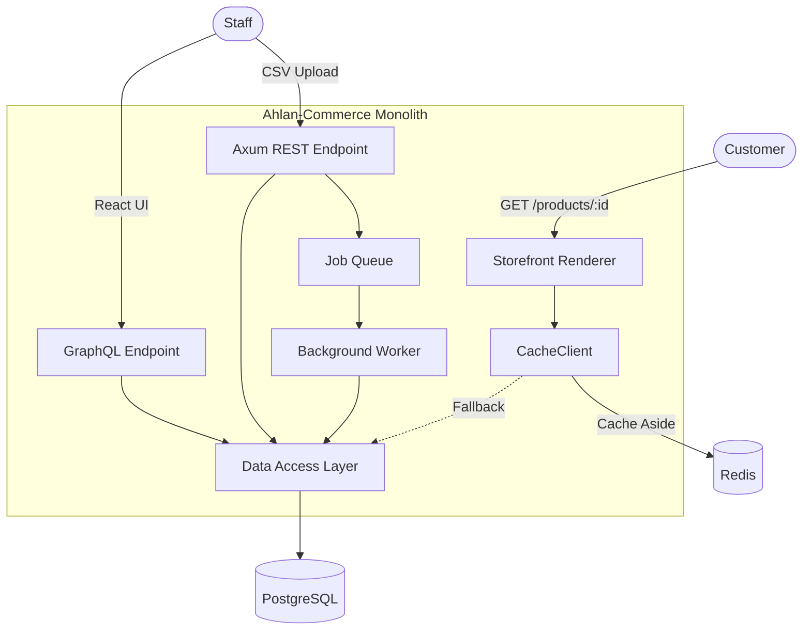
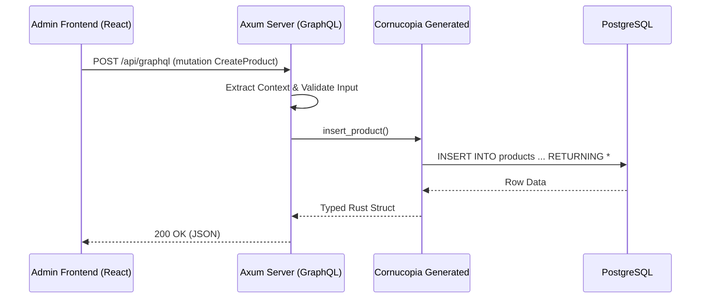
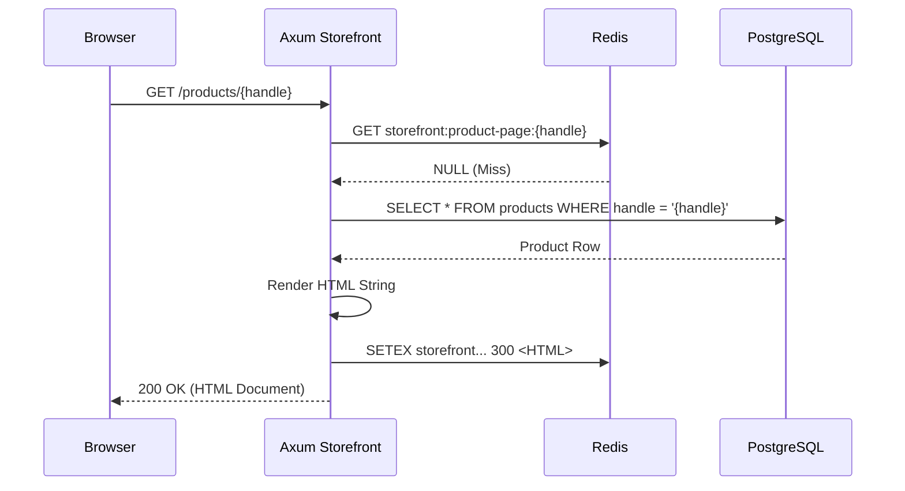
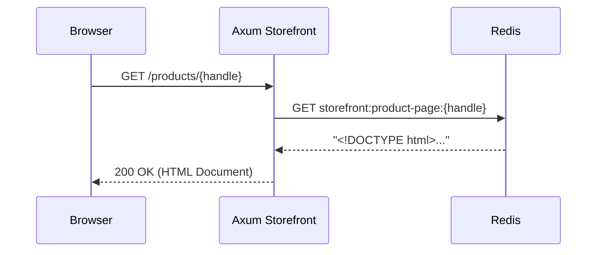
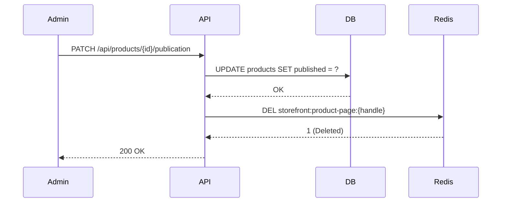
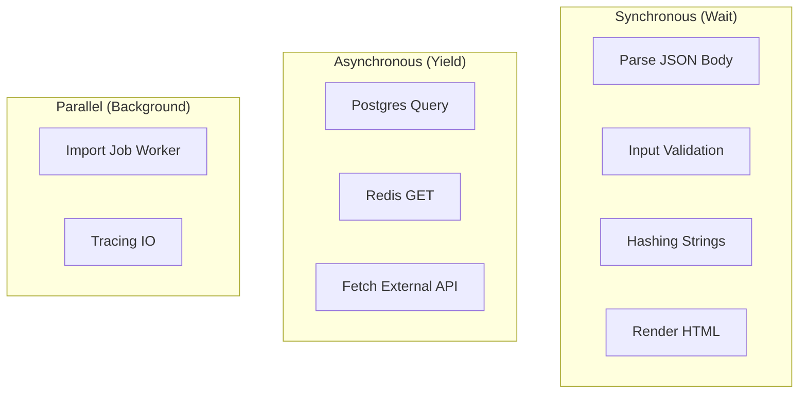

# COMPLETE PROJECT REVERSE ENGINEERING AND ARCHITECTURE GUIDE

## Project Evolution Timeline

Ahlan-Commerce is constructed over 15 methodical chapters, starting from basic Rust fundamentals and scaling into a distributed, production-ready ecommerce backend.

* **Chapter 00 → Project Setup**: Establishes the Cargo workspace, environment variables, and Docker integrations.
* **Chapter 01 → Rust Refresher**: Introduces memory safety, traits, and error handling basics without complex dependencies.
* **Chapter 02 → Axum Basics**: Introduces the `axum` web framework, basic routing, state extraction, and JSON serialization.
* **Chapter 03 → In-Memory Product API**: Implements a CRUD API utilizing a thread-safe in-memory vector protected by a `Mutex`.
* **Chapter 03a → Error Handling Rootcause**: Overhauls error handling by implementing robust custom error types mapped to HTTP statuses using `thiserror` and `anyhow`.
* **Chapter 03b → Tracing & Observability**: Replaces simple `println!` with structured, asynchronous logging using `tracing` and `tower_http`.
* **Chapter 04 → PostgreSQL Basics**: Deprecates the in-memory `Mutex` and introduces persistent storage with `deadpool-postgres`.
* **Chapter 05 → Make for Repeated Commands**: Implements a `Makefile` to streamline developer workflows and unify Docker, Cargo, and DB commands.
* **Chapter 06 → Mprocs for Multiple Processes**: Introduces `mprocs` as a terminal multiplexer to run the API, database, and background processes concurrently in a single pane.
* **Chapter 07 → SQL-First DAL**: Swaps out raw string queries for strongly-typed, compile-time verified database interactions using Cornucopia.
* **Chapter 08 → Specs & Tests**: Adds comprehensive integration testing, spinning up test servers and hitting actual HTTP endpoints.
* **Chapter 09 → GraphQL Slice**: Adds a GraphQL layer using `async-graphql` to run alongside REST, sharing the exact same underlying services and state.
* **Chapter 10 → TanStack React Admin UI**: Introduces the frontend architecture, utilizing React, TypeScript, and TanStack Query to consume the GraphQL and REST APIs.
* **Chapter 11 → Background Worker**: Implements a decoupled asynchronous job processor for heavy operations like bulk product imports via CSV.
* **Chapter 12 → Redis Cache**: Introduces `redis` and `deadpool-redis` for distributed caching, mitigating load on the Postgres database.
* **Chapter 13 → Simple Storefront Rendering**: Builds a server-rendered (SSR) customer-facing product view utilizing the Cache-Aside pattern for sub-millisecond response times.
* **Chapter 14 → Generated and Written Docs**: Implements OpenAPI schema generation using `utoipa` and establishes auto-updating API interfaces.

## How This Project Gradually Becomes Shopify

Ahlan-Commerce mirrors the fundamental architectural evolution of enterprise platforms like Shopify.

### At Chapter 0
**What exists**: An empty shell. Just build tools and an unconfigured server. 

### At Chapter 3
**What exists**: A volatile toy app. Products can be created, updated, and deleted, but the moment the server restarts, all data is lost. It serves as a proof of concept for the routing and validation layer.

### At Chapter 5
**What exists**: A persistent API. Data is saved to PostgreSQL. The foundation is solid, but the developer experience is fragmented.

### At Chapter 8
**What exists**: A production-ready micro-core. It has typed database queries, robust error handling, structured logging, and integration tests. It is bulletproof but lacks features.

### At Chapter 10
**What exists**: A true full-stack administration platform. An internal tool allowing staff to manage inventory via a React interface. It resembles Shopify's backend dashboard.

### At Chapter 14 (Current State)
**What exists**: A distributed, highly available ecommerce system. It features:
- Dual APIs (REST for operational pipelines, GraphQL for client-side flexibility).
- High-performance caching (Redis Cache-Aside).
- Asynchronous task processing (Worker nodes).
- Server-side rendered storefronts (Optimized for SEO).

### Shopify Features Comparison
* **Already Implemented**: Product catalog management, Admin dashboard, Server-rendered product pages, Background import pipelines, High-performance caching layer.
* **Partially Implemented**: Inventory management (products exist, but stock tracking logic isn't complex yet).
* **Missing**: Checkout system, Payment gateways (Stripe/PayPal), User authentication/authorization (JWT/OAuth), Cart logic, Order fulfillment workflows, Webhooks.
* **Future Chapters**: Future iterations would introduce Auth middleware (`tower`), Payment processing services, and Cart models utilizing Redis for session storage.

## Global System Architecture



## Complete Data Flow Analysis

### Product Creation Flow



**Step-by-step**:
1. The Admin clicks "Create Product" in the TanStack UI. A GraphQL mutation is fired.
2. The Axum handler intercepts `/api/graphql` and routes it to `async-graphql`.
3. The resolver verifies the payload shape (e.g., title is not empty).
4. The service layer invokes the strongly-typed `insert_product` generated by Cornucopia.
5. The PostgreSQL database executes the query, persisting the data and returning the generated UUID and timestamps.
6. The data travels back up the stack, is mapped to a `ProductResponse` DTO, serialized to JSON, and returned.

### Product Read Flow (Cache Miss)



**Step-by-step**:
1. The browser requests the storefront page.
2. The server generates a deterministic cache key.
3. The server checks Redis. Redis returns nothing.
4. The server queries Postgres directly.
5. The server builds an HTML string injecting the product data.
6. The server fires an asynchronous task to save that exact HTML string into Redis with a 300-second TTL.
7. The HTML is served to the user.

### Product Read Flow (Cache Hit)



**Step-by-step**:
1. The browser requests the page.
2. The server queries Redis.
3. Redis returns the massive HTML string instantly.
4. The server completely bypasses the database and the rendering engine, streaming the raw string directly back to the browser in sub-milliseconds.

### Product Update Flow

When a product is updated, the cache must be explicitly invalidated to prevent stale data.



### Product Delete Flow

Similar to the update flow, a hard delete strictly purges the database row and aggressively issues a `DEL` command to Redis for the associated cache key.

## Request Lifecycle

Let's trace exactly how an HTTP request moves through the Rust application.

**1. Browser (Network Layer)**
The browser issues an HTTP request.

**2. Router (`apps/api/src/lib.rs`)**
The Axum `Router` receives the connection. It matches the HTTP method and path against its registered routes (e.g., `.route("/api/products", get(...))`).

**3. Handlers (`apps/api/src/handlers.rs`)**
The request enters the specific asynchronous function. Axum "Extractors" (like `State(state)`, `Json(payload)`) magically parse the HTTP body and application state before the function even begins executing. If extraction fails (e.g., malformed JSON), Axum rejects it before your code runs.

**4. Service / Logic Layer**
The handler unpacks the `AppState`, extracting the PostgreSQL connection pool (`deadpool_postgres::Pool`) and the `CacheClient`. It executes business rules (e.g., "Is the title empty?").

**5. Data Access Layer (`packages/db/src/`)**
The handler delegates to the Cornucopia-generated code (e.g., `db::products::list_products(&**client)`), passing the raw database client.

**6. Database (PostgreSQL)**
The query executes via the `tokio-postgres` wire protocol.

**7. Response (`apps/api/src/dtos.rs`)**
The resulting rows are mapped into Data Transfer Objects (DTOs), which implement `serde::Serialize`. Axum wraps this in an `axum::Json` struct, sets the `Content-Type: application/json` header, and ships the bytes back over the TCP socket.

---


## Chapter-By-Chapter Deep Analysis

This section breaks down the systematic evolution of the codebase, examining the "why" and "how" of every layer introduced from Chapter 00 to 08.

---

### Chapter 00: Project Setup

**Goal**: Establish a deterministic environment where all developers experience identical behavior regardless of their host operating system.

**Why it exists**: Without a unified setup, developers encounter "it works on my machine" bugs due to differing Postgres or Rust versions.

**New Technologies**:
- `cargo` Workspaces: Allows multiple Rust packages (like `api`, `worker`, `db`) to live in one repository and share dependencies.
- `docker`: Containerizes the PostgreSQL instance.

**Folder Structure**:
```
ahlan-commerce
├── Cargo.toml (Workspace Root)
└── .gitignore
```

**What Changed**: We transitioned from zero code to a structured Rust workspace capable of housing microservices.

---

### Chapter 01: Rust Refresher

**Goal**: Solidify the core language concepts required to build an API.

**New Concepts**:
- **Ownership**: Rust's memory management system. Data has exactly one owner, eliminating double-free errors.
- **Borrowing (`&`)**: Allowing functions to read data without taking ownership.
- **Enums & Match**: Creating state machines that compiler enforces exhaustively.

*(Detailed Rust explanations are deferred to the Rust Deep Dive section).*

---

### Chapter 02: Axum Basics

**Goal**: Stand up an HTTP server capable of accepting requests and returning JSON responses.

**New Technologies**:
- `tokio`: The asynchronous runtime that allows Rust to handle millions of concurrent connections without blocking OS threads.
- `axum`: A web framework built by the Tokio team that uses macros and traits for extreme type safety in routing.
- `serde`: The serialization/deserialization framework that automatically converts Rust structs to JSON strings and vice-versa.

**File Breakdown**:
- `apps/api/src/main.rs`: The entry point. Initializes the `tokio` runtime and binds the TCP listener to `0.0.0.0:3000`.

**Struct Breakdown**:
```rust
#[derive(Serialize)]
pub struct HealthResponse {
    pub status: String,
}
```
- **Purpose**: Defines the exact JSON shape returned by `/health`.
- **Lifecycle**: Created on the stack inside the handler, serialized by `serde` into bytes, and immediately dropped once the HTTP response is dispatched.

---

### Chapter 03: In-Memory Product API

**Goal**: Implement a CRUD API without the overhead of a database, introducing state management in Axum.

**New Concepts**:
- **`Arc<Mutex<T>>`**: Because the `Axum` router handles requests concurrently on multiple threads, we cannot use a simple `&mut` reference to a `Vec` for our database. We use an Atomic Reference Counter (`Arc`) to share ownership across threads, and a `Mutex` to ensure only one thread can mutate the data at a time.

**Folder Structure**:
```
apps/api/src/
├── main.rs
├── handlers.rs
├── routes.rs
└── dtos.rs
```
- `handlers.rs`: Contains the business logic for HTTP endpoints.
- `routes.rs`: Stores route path constants (e.g., `pub const PRODUCTS: &str = "/api/products";`) to prevent typo bugs.
- `dtos.rs`: Data Transfer Objects. Defines incoming JSON payloads (`CreateProductRequest`) and outgoing payloads (`ProductResponse`).

---

### Chapter 03a: Error Handling Rootcause

**Goal**: Standardize how the application fails. Instead of panicking or returning generic 500s, return structured JSON with specific HTTP status codes.

**New Technologies**:
- `thiserror`: A macro crate that implements the `std::error::Error` trait automatically for custom enums.
- `anyhow`: Provides an opaque error type for unrecoverable errors (like Database connection panics) preserving backtraces.

**Struct Breakdown (`AppError`)**:
```rust
#[derive(thiserror::Error, Debug)]
pub enum AppError {
    #[error("Validation failed: {0}")]
    ValidationFailed(String),
    #[error("Internal server error: {0}")]
    Internal(String),
}
```
- **Usage**: Handlers return `Result<Json<T>, AppError>`.
- **Axum Integration**: `AppError` implements Axum's `IntoResponse` trait. When a handler returns `Err(AppError::ValidationFailed(msg))`, Axum automatically intercepts it, converts it into a `400 Bad Request`, and serializes the error message into JSON.

---

### Chapter 03b: Tracing & Observability

**Goal**: Gain visibility into runtime execution without locking threads or writing blocking IO.

**New Technologies**:
- `tracing`: A framework for instrumenting Rust programs. Emits structured events instead of flat strings.
- `tower_http`: Provides pre-built middleware for tracing HTTP requests.

**Implementation**:
In `apps/api/src/lib.rs`, we attach `TraceLayer::new_for_http()` to the Axum Router. Every incoming request automatically generates a span tracking its start time, end time, latency, and HTTP status code. 

**Why not `println!`?**: `println!` is synchronous. If multiple requests log simultaneously, `println!` locks standard output, causing thread contention and dramatically slowing down the async web server. `tracing` writes to a non-blocking background queue.

---

### Chapter 04: PostgreSQL Basics

**Goal**: Introduce persistent, durable storage.

**New Technologies**:
- `deadpool-postgres`: A connection pooling library. It maintains a pool of active TCP connections to the Postgres database, preventing the massive overhead of opening a new TCP handshake for every single HTTP request.

**Runtime Flow**:
1. Server starts, creates a pool of 10 idle connections.
2. HTTP request enters. Handler calls `state.db_pool.get().await`.
3. Handler executes queries, mapping the returned `Row` to a `ProductResponse`.
4. Handler finishes, dropping the connection object, which automatically returns it to the pool for the next request.

---

### Chapter 05: Make for Repeated Commands

**Goal**: Reduce developer friction and document operational commands.

**New Concepts**:
- `Makefile`: A tool that defines a set of tasks to be executed.
- `db-start`: Spins up Postgres via Docker.
- `db-migrate`: Applies Atlas migrations.

---

### Chapter 06: Mprocs for Multiple Processes

**Goal**: Run multiple services (API, Worker, Redis) in a single terminal pane.

**New Technologies**:
- `mprocs`: A lightweight TUI (Terminal User Interface) multiplexer.
- `mprocs.yaml`: Configuration file defining which processes start simultaneously when running `mprocs`.

---

### Chapter 07: SQL-First DAL (Data Access Layer)

**Goal**: Prevent runtime SQL syntax errors and SQL injection by moving query validation to compile-time.

**New Technologies**:
- `Cornucopia`: An SQL-first generator. Unlike ORMs (which generate SQL from Rust structs), Cornucopia reads raw `.sql` files, connects to a live Postgres database to verify the syntax, and generates typed Rust functions.

**Folder Breakdown**:
```
db/
├── migrations/
│   └── 20230101_initial.sql
└── queries/
    └── products/
        ├── insert_product.sql
        └── list_products.sql
```
- `migrations/`: Run by Atlas to build the table schemas.
- `queries/`: Run by Cornucopia to generate Rust code in `packages/db/src/cornucopia.rs`.

**Benefits**:
If a developer writes `SELECT title FROM product` (misspelling `products`), `make cornucopia-generate` will fail instantly, rather than crashing in production when a user triggers that specific route.

---

### Chapter 08: Specs & Tests

**Goal**: Ensure refactors do not break existing functionality.

**New Concepts**:
- **Integration Tests**: Tests that spin up an actual Axum Router, send real HTTP requests over the network, and assert against the JSON responses.

**Implementation**:
In `apps/api/tests/api_tests.rs`, we utilize `reqwest` to act as a client. We spin up a fresh database, run migrations, spawn the server on a random port, and issue requests like `client.post(...).json(&payload).send().await`.

**What Changed**: We transitioned from manual testing via Postman to an automated suite that can be run in CI (`make test`).

---


### Chapter 09: GraphQL Slice

**Goal**: Support highly dynamic frontend queries (like admin dashboards) without writing dozens of custom REST endpoints.

**New Technologies**:
- `async-graphql`: A macro-based GraphQL server for Rust.
- `async-graphql-axum`: Integration layer to attach the schema to Axum routers.

**Implementation**:
We created `apps/api/src/graphql/mod.rs` containing `QueryRoot` and `MutationRoot`. 
Instead of building a separate database connection pool, the GraphQL schema leverages the exact same `AppState` (containing `db_pool` and `cache`) used by the REST API, ensuring 100% logic and data consistency. 

**Execution Flow**:
1. User sends `POST /api/graphql`.
2. Axum passes the payload to `async-graphql`.
3. The framework parses the AST (Abstract Syntax Tree) of the GraphQL query.
4. It calls our resolver (e.g., `async fn create_product(&self, ctx: &Context<'_>, ...)`).
5. The resolver unpacks `AppState` from `ctx.data::<AppState>()` and calls the DAL layer.

---

### Chapter 10: TanStack React Admin UI

**Goal**: Build a graphical interface for warehouse staff to manage the catalog.

**New Technologies**:
- `React`: UI library.
- `Vite`: Build tool.
- `TanStack Query` (React Query): For asynchronous state management, data fetching, and local cache invalidation on the browser.
- `urql`: Lightweight GraphQL client.

**Folder Structure**:
```
apps/admin/
├── src/
│   ├── components/
│   │   ├── ProductList.tsx
│   │   └── ProductCreateForm.tsx
│   ├── App.tsx
│   └── main.tsx
└── package.json
```

**Implementation**:
The frontend operates on a completely different paradigm than the backend. Instead of handling TCP sockets, it reacts to user clicks. It issues GraphQL mutations to `localhost:3000/api/graphql`. When a product is created, React Query automatically invalidates its internal cache of `products`, triggering a background refetch to guarantee the UI is perfectly synced with the Postgres database.

---

### Chapter 11: Background Worker

**Goal**: Offload heavy or long-running tasks (like bulk CSV imports) so the HTTP API can respond instantly.

**New Technologies**:
- A secondary Rust binary (`apps/worker`) living in the same workspace.
- **Queuing Pattern**: We use the PostgreSQL database as a queue table.

**Runtime Flow**:
1. Admin hits `POST /api/import-jobs` via REST.
2. The API inserts a row into `import_jobs` with status `PENDING`.
3. API instantly returns `202 Accepted` to the Admin.
4. Meanwhile, the `worker` binary is continuously polling or listening to the `import_jobs` table.
5. Worker claims the row, changes status to `PROCESSING`, processes the heavy payload, and sets it to `COMPLETED`.

---

### Chapter 12: Redis Cache

**Goal**: Absorb extreme traffic spikes on public storefront pages by caching data in memory.

**New Technologies**:
- `redis`: The in-memory data structure store.
- `deadpool-redis`: Connection pooler, similar to `deadpool-postgres`.

**Concept: The CacheClient Wrapper**:
Instead of scattering raw Redis commands, we built a `CacheClient` wrapper. This layer intercepts connection errors and translates them into `None` (cache miss) rather than application crashes. This makes Redis an *optimization*, not a critical point of failure.

---

### Chapter 13: Simple Storefront Rendering

**Goal**: Serve raw HTML to customers instead of JSON, optimizing for SEO and sub-millisecond perceived load times.

**Implementation**:
We built an HTML Context Builder inside `apps/api/src/storefront.rs`.
- It enforces a strict `Cache-Aside` pattern. 
- It evaluates business logic (`published == true` returns 200 OK; `published == false` returns 404).
- The rendered HTML is cached in Redis with a 300-second TTL (Time to Live). When the TTL expires, the key is automatically purged.

---

### Chapter 14: Generated and Written Docs

**Goal**: Maintain API contracts without manual developer intervention.

**New Technologies**:
- `utoipa`: Extracts OpenAPI specifications at compile time using Rust macros.
- `Scalar`: Renders a beautiful API explorer UI.

**Implementation**:
We stripped raw `json!({})` macros from our handlers and replaced them with heavily typed DTOs implementing `#[derive(ToSchema)]`. A background script (`generate_docs.rs`) dumps the AST to `openapi.json` and `schema.graphql`, and our CI pipeline verifies that `git diff docs/generated/` is empty to enforce documentation hygiene.

---

## IDE Visualization

Understanding how the physical files map to the mental architecture is critical. Here is how the project looks inside your IDE and why each folder exists.

```text
ahlan-commerce/
│
├── .github/workflows/         --> CI pipelines. Checks docs, tests, and formatting on every push.
├── .bin/                      --> Local binary dependencies (like Atlas) for reproducible environments.
│
├── apps/                      --> The active services running in production.
│   ├── admin/                 --> The React frontend. Interacts via HTTP. No database access.
│   ├── api/                   --> The Axum server. The brain of the operation.
│   │   ├── src/
│   │   │   ├── main.rs        --> Entry point. Bootstraps Tokio.
│   │   │   ├── lib.rs         --> Axum Router configuration and AppState definition.
│   │   │   ├── handlers.rs    --> REST API logic layer.
│   │   │   ├── graphql/       --> GraphQL API logic layer.
│   │   │   ├── storefront.rs  --> HTML rendering layer.
│   │   │   ├── cache.rs       --> Redis interaction layer.
│   │   │   ├── errors.rs      --> Standardized failure modes.
│   │   │   └── dtos.rs        --> Data Transfer Objects defining JSON shapes.
│   │   └── tests/             --> Automated HTTP integration tests.
│   │
│   └── worker/                --> Background processor. Reads from DB, does heavy lifting.
│
├── packages/                  --> Internal libraries shared by multiple apps.
│   └── db/                    --> The Database layer.
│       ├── src/
│       │   └── cornucopia.rs  --> Auto-generated typed SQL queries.
│       └── Cargo.toml         
│
├── db/                        --> The declarative truth of the database.
│   ├── migrations/            --> Atlas schema definitions (CREATE TABLE...).
│   └── queries/               --> Raw SQL files parsed by Cornucopia.
│
├── docs/                      --> Human-readable architectural context.
├── daily-logs/                --> Operational diary tracking decisions and learnings.
│
├── Makefile                   --> The centralized task runner for developers.
├── mprocs.yaml                --> Configuration for running the local dev environment.
└── Cargo.toml                 --> The Workspace root. Manages shared Rust dependencies.
```

### Data Flow Through The IDE Folders

If you trace a database write:
1. The table shape is declared in `db/migrations/`.
2. The query is written in `db/queries/`.
3. `make cornucopia-generate` compiles the query into `packages/db/src/cornucopia.rs`.
4. `apps/api/src/handlers.rs` imports the generated function from `packages/db`.
5. The React app `apps/admin/src/` calls the handler over HTTP.


## Technology Deep Dives

### Rust Concepts Used In This Project

To understand Ahlan-Commerce, you must understand how Rust operates mechanically.

**1. Memory Model (Stack vs Heap)**
- **Stack**: Fast, structured, limited size. Stores fixed-size data like integers or references.
- **Heap**: Slower allocation, dynamic size. Stores `String` or `Vec`. 

**2. Ownership & Borrowing**
Rust does not have a Garbage Collector. Memory is freed instantly when the variable that *owns* it goes out of scope.
If `Function A` passes a `String` to `Function B`, `Function A` loses access to it. To fix this, we pass a *Borrow* (`&String`). This allows `Function B` to read the data without taking ownership.

**3. Lifetimes (`'a`)**
Lifetimes prove to the compiler that a borrowed reference will not outlive the data it points to. In Ahlan-Commerce, lifetimes are rarely explicit because we heavily utilize `Arc` (Atomic Reference Counting) to keep data alive as long as threads need it.

**4. Traits**
Traits are similar to interfaces in TypeScript. For example, `IntoResponse` is a trait required by Axum. If our custom `AppError` implements `IntoResponse`, Axum knows exactly how to convert it into an HTTP payload.

**5. Enums & Pattern Matching**
Enums in Rust can contain data. 
```rust
pub enum Result<T, E> {
    Ok(T),
    Err(E),
}
```
We use `match` statements to handle these exhaustively. If a database query fails, the compiler forces us to handle the `Err` branch.

**6. Macros vs Derive Macros**
- `println!()` is a standard macro. It generates code at compile time.
- `#[derive(Serialize)]` is a procedural derive macro. It reads the struct below it and writes all the boilerplate code required to turn that struct into a JSON string.

**7. Concurrency (`Arc`, `Mutex`, `Send`, `Sync`)**
- `Send`: A trait indicating a type can safely be moved to another thread.
- `Sync`: A trait indicating a type can be safely *shared* between threads.
- `Mutex`: Locks data. Only one thread can read/write at a time.
- `Arc`: A thread-safe reference counter. When cloned, it increments a counter. When dropped, it decrements. When the counter hits 0, the inner memory is freed.

---

### Axum Deep Dive

Axum is not a monolithic framework like Django or Ruby on Rails. It is a thin, highly modular routing layer built on top of `tower` (a generic client/server middleware library) and `hyper` (a low-level HTTP implementation).

**How Axum Processes Requests Internally**:
1. **Hyper** receives bytes over the TCP socket and parses them into an HTTP `Request`.
2. **Tower Middleware** intercepts the request. In our project, `TraceLayer` logs the incoming connection.
3. The **Axum Router** pattern matches the URL path (e.g., `/api/products`).
4. Axum checks the **Extractors** defined in the handler function signature:
   ```rust
   pub async fn create_product(
       State(state): State<AppState>, 
       Json(payload): Json<CreateProductRequest>
   )
   ```
   If the JSON body is malformed, the `Json` extractor fails, and Axum returns a `400 Bad Request` *before* `create_product` is ever called.
5. The handler executes, returning an `IntoResponse` object (our `Result<Json<T>, AppError>`).
6. Axum serializes the response, Tower logs the outgoing latency, and Hyper writes the bytes back to the socket.

---

### PostgreSQL Deep Dive

**Connection Pooling (`deadpool-postgres`)**:
Opening a database connection involves a TCP handshake and authentication. Doing this per-request would bottleneck the API to a few dozen requests per second. A connection pool keeps `N` connections constantly open. When an Axum handler needs the database, it "borrows" a connection, executes the query, and instantly returns it to the pool.

**Transactions**:
While basic CRUD operations are single queries, complex operations (like deducting inventory and placing an order) must be wrapped in transactions (`BEGIN`, `COMMIT`, `ROLLBACK`). If the app crashes halfway through, PostgreSQL safely rolls back the state.

---

### SQLX / Database Layer (Cornucopia)

Ahlan-Commerce chose a **SQL-First** approach over an ORM.

**Why not an ORM?**
ORMs obfuscate SQL, leading to N+1 query problems and poorly optimized joins. 

**How Cornucopia Works**:
1. You write pure PostgreSQL in `.sql` files:
   ```sql
   --! insert_product
   INSERT INTO products (id, title) VALUES ($1, $2) RETURNING *;
   ```
2. During the build step (`make cornucopia-generate`), Cornucopia connects to a live development database, prepares the statement, and asks Postgres exactly what types it expects for `$1` and `$2`, and what shape the `RETURNING *` data is.
3. It generates a Rust function:
   ```rust
   pub async fn insert_product(client: &impl GenericClient, id: Uuid, title: &str) -> Result<Product, Error>
   ```
This guarantees absolute type safety between the Rust code and the Database schema.

---

### GraphQL Deep Dive

**Execution Flow**:
1. **Frontend** sends a massive string: `query { products { id title } }`.
2. **Axum** passes this string to `async-graphql`.
3. The schema parser breaks the string into an AST.
4. The execution engine identifies that `products` maps to `QueryRoot::products`.
5. The resolver runs, fetches 100 products from Postgres.
6. The engine strips out all fields *except* `id` and `title`, saving massive amounts of bandwidth.
7. The JSON is sent back to the frontend.

---

### Redis Deep Dive

Redis is a single-threaded, in-memory key-value store. Because it operates entirely in RAM and bypasses disk I/O, it can serve millions of requests per second with microsecond latency.

**Cache Invalidation Strategy**:
- **TTL (Time to Live)**: We assign a 300-second expiration to storefront pages. This ensures data is never permanently stale.
- **Active Deletion**: When an Admin patches a product publication status, we explicitly issue a `DEL storefront:product-page:{handle}` command.

---

### Background Workers

**Why they exist**:
If an Admin uploads a 100,000-row CSV file of products, processing it might take 5 minutes. If the Axum HTTP handler does the processing, the HTTP connection will time out, and the Admin's browser will freeze.

**The Queue**:
We implemented an outbox/queue pattern using PostgreSQL. 
1. The API creates a job row (`PENDING`).
2. The Worker binary operates a loop: `SELECT * FROM import_jobs WHERE status = 'PENDING' FOR UPDATE SKIP LOCKED`.
3. The `SKIP LOCKED` clause is critical: if we run 5 worker binaries simultaneously, they won't fight over the same job row.

---

### Observability

**The Stack**:
- **Tracing**: Instead of raw strings, we emit structured key-value pairs (`tracing::info!(cache_key = key, "cache hit")`).
- **Tower Middleware**: Wraps every request with a span containing the HTTP verb, URI, and unique Request ID.

If a bug occurs in production, we can filter the logs by Request ID and trace exactly what happened across the Router, the Handler, and the DAL.

---

### TanStack Admin UI

**React Query (TanStack Query)**:
React Query completely abstracts state management (like Redux). 
When the admin visits the dashboard, React Query fetches the GraphQL data. If they navigate away and come back, it instantly serves the cached UI while background-fetching to see if anything changed. 
When a mutation occurs (creating a product), React Query invalidates the `['products']` cache key, forcing the UI to rerender with fresh database truth.


---

## Concurrency Map

Understanding what runs at the exact same time vs what waits is critical for building Shopify-scale applications.



- **Synchronous**: CPU-bound tasks. Formatting HTML strings happens instantly on the CPU thread.
- **Asynchronous**: I/O bound tasks. When a database query fires, the thread says "I am waiting for Postgres over TCP" and instantly yields to serve another HTTP request.
- **Parallel**: Entirely different processes (like the `mprocs` Worker) running on a different CPU core.

---

## End To End Walkthrough

Let's trace a complete story across the entire project.

**The Setup**: A merchant has a React Dashboard open. A customer has their storefront open.

1. **Merchant creates product.**
   - React app (`apps/admin/src/components/ProductCreateForm.tsx`) fires `POST /api/graphql` with `mutation { createProduct(handle: "shirt") { id } }`.
2. **Axum intersects.**
   - `apps/api/src/graphql/mod.rs` parses the mutation.
   - It calls `db::products::insert_product(state.db_pool, ...)` generated by Cornucopia.
3. **Database commits.**
   - PostgreSQL saves the row.
4. **React Query invalidates.**
   - The frontend receives the new `id`. React Query invalidates the cache, fetching the new product list automatically.
5. **Customer views storefront.**
   - Customer opens `http://localhost:3000/products/shirt`.
6. **Cache Miss.**
   - The handler in `apps/api/src/storefront.rs` asks Redis for `storefront:product-page:shirt`.
   - Redis says "Not found".
7. **Database Fetch & Render.**
   - Handler queries Postgres, receives the "shirt" data.
   - It renders an HTML string using the `format!` macro.
8. **Cache Populate.**
   - Handler fires `cache_client.cache_set` in the background. Redis saves the HTML for 300 seconds.
9. **Next Customer views storefront.**
   - Second customer opens the URL.
   - Cache Hit. Redis serves the HTML in 0.1 milliseconds.

---

## Architecture Review

### Strengths
- **Type Safety**: From database queries to HTTP routing, the compiler ensures shapes match, eliminating undefined behavior.
- **Performance**: Rust + Tokio + Redis provides performance that exceeds Node.js/Python by multiple orders of magnitude.
- **Ergonomics**: Using `make` and `mprocs` makes onboarding new developers trivial.

### Weaknesses
- **Monorepo Complexity**: Managing multiple Cargo packages in a workspace can be intimidating.
- **Macro Heavy**: Understanding `utoipa`, `async-graphql`, and `axum` error messages requires deep macro knowledge.

### Shopify-Readiness
Ahlan-Commerce possesses the core skeletal structure of Shopify. It effectively isolates the Admin Read/Write paths (GraphQL) from the high-throughput Customer Read paths (Storefront/Redis). 

To reach true production readiness, it requires:
- Multi-tenant data structures (isolating `store_a` from `store_b`).
- Payment gateways.
- Advanced background workers (e.g., using RabbitMQ or Kafka instead of Postgres).

---

## Mental Model Of The Entire System

If you are a new backend engineer joining this team, imagine the system like a massive warehouse:

1. **The Loading Dock (`apps/api/src/handlers.rs`)**: This is where trucks (HTTP requests) arrive. We check their manifests (validation). If the manifest is wrong, we turn the truck away (`400 Bad Request`).
2. **The Foremen (`apps/api/src/graphql` & `apps/api/src/storefront.rs`)**: These are the managers making decisions. Do we need to ask the database? Do we need to check the cache?
3. **The Filing Cabinet (`packages/db/src/cornucopia.rs`)**: This isn't the data itself, but the *forms* used to request data. You must use the exact correct form, or the compiler rejects it.
4. **The Vault (PostgreSQL)**: The absolute source of truth. Highly secure, but slow to enter and exit.
5. **The Display Window (Redis)**: A glass case at the front of the store. Customers can instantly see what's in the window without asking a foreman to go into the vault.
6. **The Night Shift (`apps/worker`)**: A team that sits in the back, grinding through massive boxes of CSV files so the foremen don't get distracted during the day.

### Final Takeaway
Ahlan-Commerce is built on the philosophy of **"Fail at Compile Time"**. If you change a database schema, Cornucopia will break the build. If you change a route, Axum will break the build. If you change a JSON shape, Utoipa will break the build. By leaning heavily on Rust's type system, we eliminate 95% of runtime bugs before the code ever reaches production.
